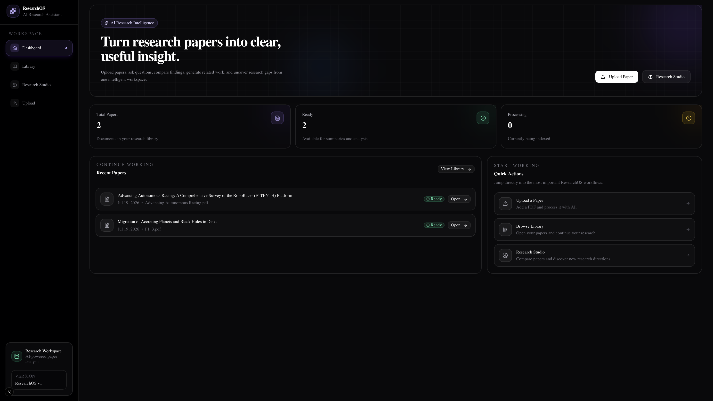
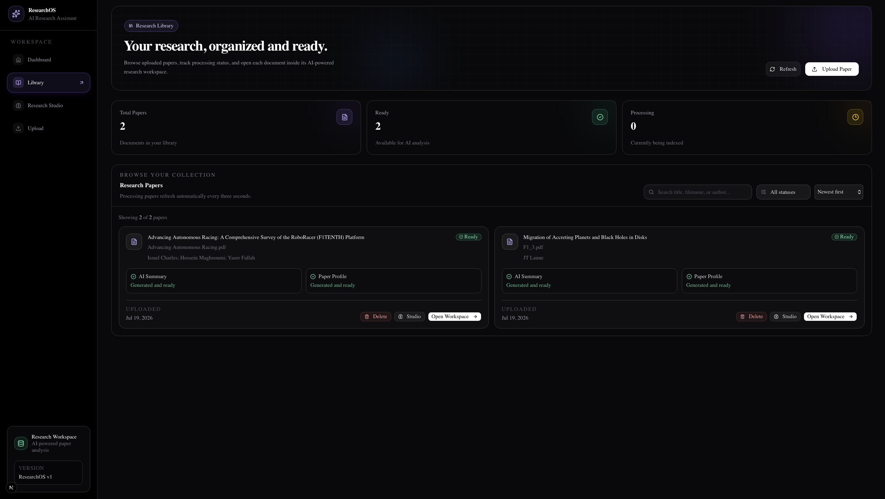
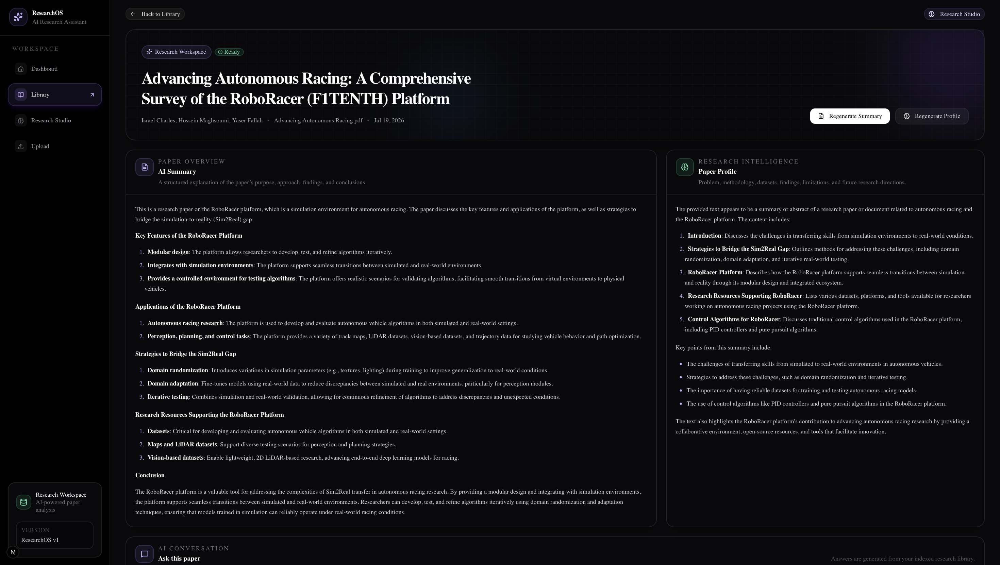
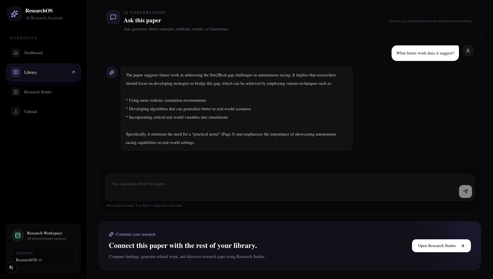
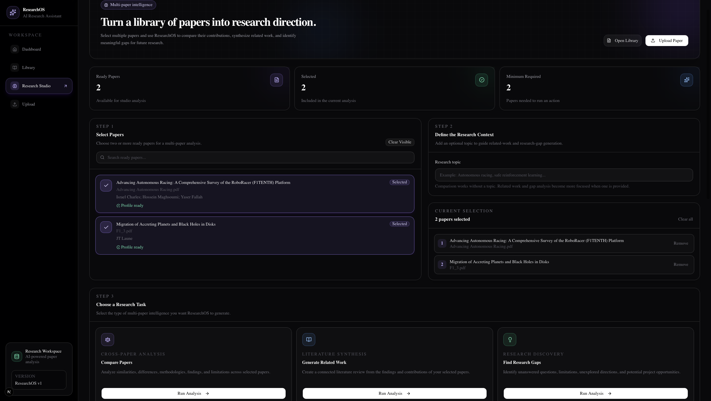
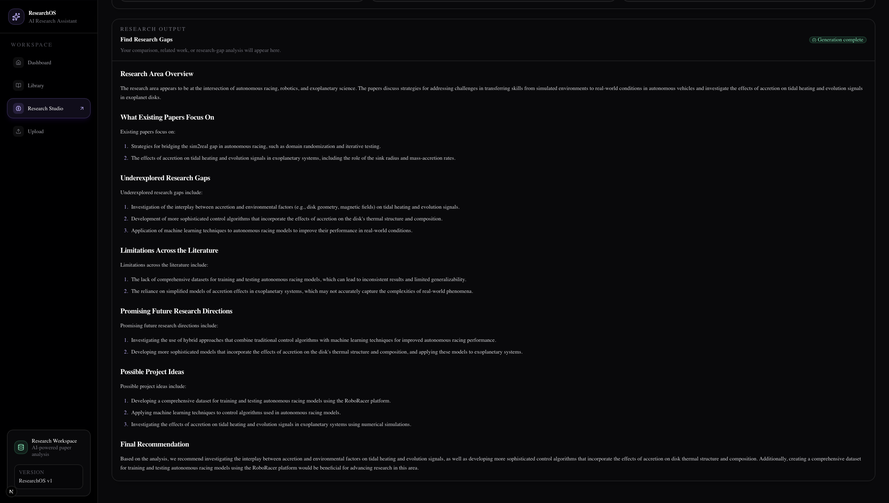
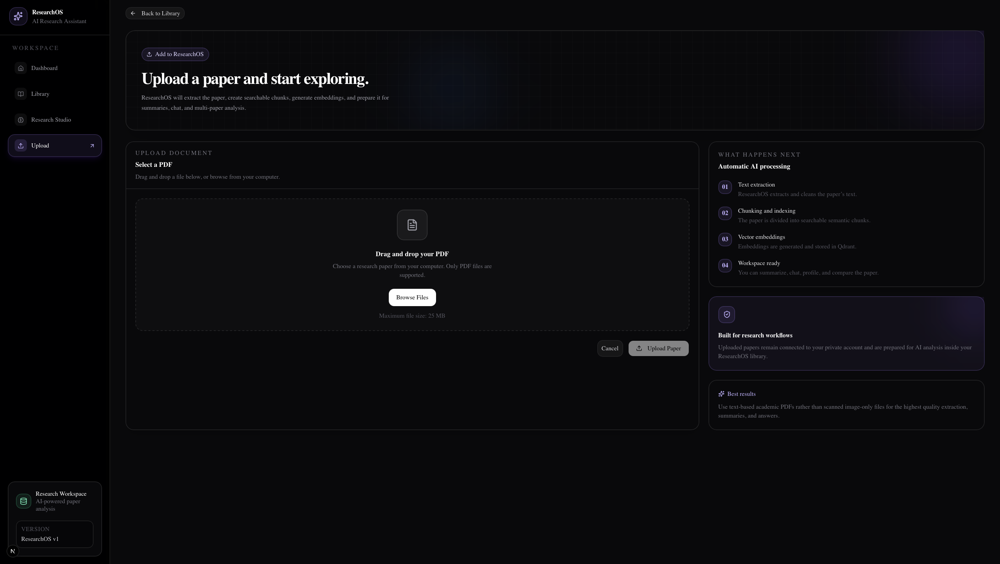

# ResearchOS

An AI-powered research assistant that helps researchers organize, analyze, and understand academic papers using Large Language Models, semantic search, and Retrieval-Augmented Generation (RAG).

ResearchOS provides an end-to-end workflow for uploading research papers, generating AI summaries, creating structured paper profiles, asking questions about individual papers, and performing multi-paper analysis such as comparisons, related work generation, and research gap identification.

---
## Live Demo

🎥 **[Watch the Demo Video](ttps://drive.google.com/file/d/1Hg8GaY1zn21ZDt8BZvaG7_lV4yJ-xnbj/view?usp=share_link)**

---

## Features

### Authentication
- User registration and login
- JWT authentication
- Secure user-specific research library

### Research Library
- Upload PDF research papers
- Automatic background processing
- Processing status tracking
- Delete papers and associated embeddings
- Search and filter uploaded papers

### AI Research Workspace
Each uploaded paper includes:

- AI-generated summary
- Structured paper profile
- Interactive AI chat
- Markdown rendering
- Processing status

### Research Studio

Analyze multiple papers simultaneously.

- Compare Papers
- Generate Related Work
- Identify Research Gaps

### AI Pipeline

- PDF text extraction
- Text cleaning
- Intelligent chunking
- Sentence embeddings
- Vector search with Qdrant
- Local LLM inference using Ollama

---

# Tech Stack

## Frontend

- Next.js 16
- React
- TypeScript
- Tailwind CSS
- shadcn/ui
- Lucide Icons

## Backend

- FastAPI
- SQLAlchemy
- PostgreSQL
- Alembic
- Redis
- Celery
- JWT Authentication

## AI Stack

- Ollama
- Sentence Transformers
- Qdrant Vector Database
- Retrieval-Augmented Generation (RAG)

---

# Architecture

```text
                 Upload PDF
                      │
                      ▼
              FastAPI Backend
                      │
          Background Celery Worker
                      │
      PDF Extraction & Cleaning
                      │
             Text Chunking
                      │
        Sentence Embeddings
                      │
              Qdrant Storage
                      │
        Retrieval + Ollama LLM
                      │
             AI Responses
```

---

# Project Structure

```text
ResearchOS/
│
├── backend/
│   ├── app/
│   ├── alembic/
│   └── requirements.txt
│
├── frontend/
│   ├── src/
│   ├── public/
│   └── package.json
│
└── README.md
```

---

# Installation

## Backend

```bash
cd backend

python -m venv .venv

source .venv/bin/activate

pip install -r requirements.txt
```

Run migrations

```bash
alembic upgrade head
```

Start backend

```bash
uvicorn app.main:app --reload
```

Run Celery

```bash
celery -A app.core.celery_app worker --loglevel=info --pool=solo
```

---

## Frontend

```bash
cd frontend

npm install

npm run dev
```

---

# Environment Variables

## Backend (.env)

```env
DATABASE_URL=

REDIS_URL=

SECRET_KEY=

OLLAMA_BASE_URL=

QDRANT_URL=
```

## Frontend (.env.local)

```env
NEXT_PUBLIC_API_URL=http://localhost:8000
```

---

# Usage

1. Register an account
2. Upload research papers
3. Wait for processing to complete
4. Open a paper workspace
5. Generate an AI summary
6. Generate a paper profile
7. Chat with the paper
8. Open Research Studio
9. Compare multiple papers
10. Generate related work
11. Discover research gaps

---
# Screenshots

## Dashboard
Get a complete overview of your research library, recent papers, and AI-powered workflows.



---

## Library
Organize, search, and manage uploaded papers with AI-generated summaries and profiles.



---

## Research Workspace – AI Summary & Profile
Explore AI-generated summaries and structured research profiles for individual papers.




---

## Research Workspace – AI Chat
Ask natural-language questions and receive context-aware answers grounded in the uploaded paper.



---

## Research Studio – Paper Selection
Select multiple papers and launch AI-powered comparison, literature synthesis, or research gap analysis.



---

## Research Studio – Generated Output
Generate structured research insights, including comparisons, related work, and research gaps.



---

## Upload
Upload PDF research papers for automatic extraction, embedding, indexing, and AI analysis.



---

# Future Improvements

- Citation generation
- PDF annotation
- Paper recommendations
- Research project management
- Cloud deployment
- Multi-model support
- Team collaboration
- Export to Markdown/PDF

<!-- ---

# License

This project is licensed under the MIT License.

--- -->

<!-- # Author

**Shagun**

Built as a full-stack AI research platform using modern web technologies, Retrieval-Augmented Generation (RAG), and local LLMs. -->